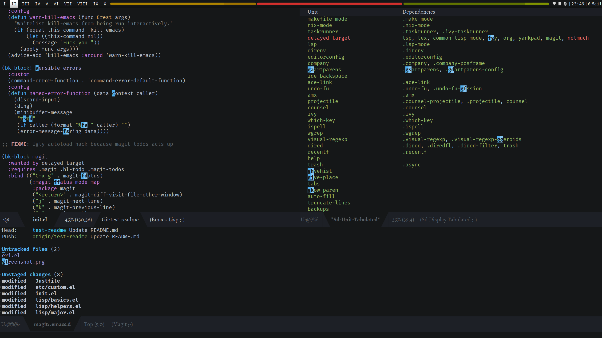

    <h1><i>Fastiter Emacs</i></h1>
    simple Emacs configuration using custom tooling

<h3></h3>

**About**

This is my new Emacs configuration, after having given up my literate and evil-centric [old setup](https://github.com/leotaku/literate-emacs).
It uses my own [fi-emacs](https://github.com/leotaku/fi-emacs) to structure its init file in a file-centric and consistent manner.

**Screenshot**

**Configuration**

The custom vi-like keybinding theme centers around [modalka](https://github.com/mrkkrp/modalka) and my own [theist-mode](https://github.com/leotaku/theist-mode).
Visuals are supported by a customized versions of [doom-themes](https://github.com/leotaku/emacs-doom-themes), [moody](https://github.com/tarsius/moody) and [minions](https://github.com/tarsius/minions).
Fonts used are [Fira Mono](https://github.com/mozilla/Fira) and [Alegreya Sans](https://github.com/huertatipografica/Alegreya-Sans).
Other than that, we use many more great and helpful packages from the Emacs community. 
Simply visit [package-set.el](package-set.el) to find them.
